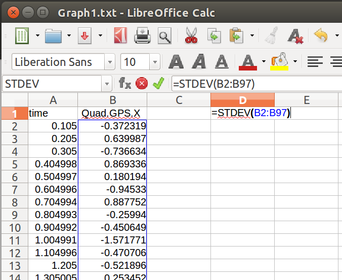

## Project: Building an Estimator
### Marko Sarkanj


---


### Writeup / README

This writeup contains the description of implementation of the Building an Estimator project. This project has been completed as part of the Self Flying Car Nanodegree program from Udacity.

### Code Implementation

#### 1. Determining the standard deviation of the measurement noise of both GPS X data and Accelerometer X data

The standard deviation of the measurement noise of both GPS X data and Accelerometer X data has been calculated with the help of `Graph1.txt` and `Graph2.txt` log files and the `STDEV` Excel formula. 



The standard deviation determined in the described way is capturing ~68% of the sensor measurements. 

#### 2. Implementing a better rate gyro attitude integration scheme in the UpdateFromIMU() function

The `UpdateFromIMU()` function has been implemented with the help of quaternions. First `bodyRateEst` quaternion has been created with the help of `FromEuler123_RPY()` function. Input of that function are roll, pitch and yaw estimates. Afterwards the `IntegrateBodyRate()` function has been called to integrate the gyroscope measurements into the `bodyRateEst` quaternion. Then the new roll, pitch and yaw values have been extracted by calling the appropriate functions on the `bodyRateEst` quaternion. As the last step the yaw value has been normalized to value that represents rotations up to the radius of one circle.

```cpp
  Quaternion<float> bodyRateEst;
  V3D bodyRateGyro{static_cast<double>(gyro.x), static_cast<double>(gyro.y), static_cast<double>(gyro.z)};

  bodyRateEst = bodyRateEst.FromEuler123_RPY(rollEst, pitchEst, ekfState(6));
  bodyRateEst = bodyRateEst.IntegrateBodyRate(bodyRateGyro, static_cast<double>(dtIMU));

  float predictedPitch = bodyRateEst.Pitch();
  float predictedRoll = bodyRateEst.Roll();
  ekfState(6) = bodyRateEst.Yaw();

  // normalize yaw
  if (ekfState(6) > F_PI) ekfState(6) -= 2.f * F_PI;
  if (ekfState(6) < -F_PI) ekfState(6) += 2.f * F_PI;
```

#### 3. Implementing all of the elements of the prediction step for the estimator

The update step `PredictState()` has been implemented according to the `7.2 Transition Model` from the Estimation for Qadrotors paper provided by Udacity. The first step is to convert the attitude from the local to global frame. This has been achieved with the `Rotate_BtoI()` function called on the `Quaternion` object. 

The next step is to update the `predictedState` vector by adding the velocity contained in the `currState` vector multiplied by the time `dt` . The velocity has been updated in the  `predictedState` vector by adding the previously transformed acceleration values `accelInertFrame` multiplied by the time elapsed `dt`. To calculate the altitude velocity it was necessary first to substract the acceleration caused by the gravity from the `accelInertFrame.z`.

```cpp
    V3F accelInertFrame = attitude.Rotate_BtoI(accel);
    predictedState[0] += curState[3] * dt;
    predictedState[1] += curState[4] * dt;
    predictedState[2] += curState[5] * dt;

    predictedState[3] += accelInertFrame.x * dt;
    predictedState[4] += accelInertFrame.y * dt;
    predictedState[5] += (accelInertFrame.z - static_cast<float>(CONST_GRAVITY)) * dt;
```

Rgb prime matrix has been implemented according to the `7.2 Transition Model` from the Estimation for Qadrotors paper as well. The implementation is straightforward by calculating sine and cosine values of the roll, pitch and yaw angles and performing mathematical operations on them for each cell of the matrix as described by paper.

```cpp
    float sinPitch = sin(pitch);
    float cosPitch = cos(pitch);

    float sinRoll = sin(roll);
    float cosRoll = cos(roll);

    float sinYaw = sin(yaw);
    float cosYaw = cos(yaw);

    RbgPrime(0,0) = - cosPitch * sinYaw;
    RbgPrime(0,1) = - sinRoll * sinPitch * sinYaw - cosRoll * cosYaw;
    RbgPrime(0,2) = - cosRoll * sinPitch * sinYaw + sinRoll * cosYaw;
    RbgPrime(1,0) = cosPitch * cosYaw;
    RbgPrime(1,1) = sinRoll * sinPitch * cosYaw - cosRoll * sinYaw;
    RbgPrime(1,2) = cosRoll * sinPitch * cosYaw + sinRoll * sinYaw;
```

`g'` is described under the same section of the Estimation for Qadrotors paper as well. The implementation is straightforward by adding `dt` value specific cells of the identity matrix and adding RGB prime multiplied by the acceleration and time as described in the paper to the appropriate cells.


```cpp
    gPrime(0,3) = dt;
    gPrime(1,4) = dt;
    gPrime(2,5) = dt;
    gPrime(3,6) = (RbgPrime(0) * accel).sum() * dt;
    gPrime(4,6) = (RbgPrime(1) * accel).sum() * dt;
    gPrime(5,6) = (RbgPrime(2) * accel).sum() * dt;

```

At the end covariance has been calculated with help of the `g'` as described in the EKF section of the paper.

```cpp
    ekfCov = gPrime * ekfCov * gPrime.transpose() + Q;
```

#### 4. Implementing the magnetometer update

Current estimated yaw state `zFromX` has been taken from the EKF state `ekfState(6)`. Current magnetometer yaw reading has been stored in the `magYaw` variable. The only step necessary was normalizing the difference from the current estimated yaw state and the magnetometer reading. This has been achieved by making sure that the difference between the estimated yaw and the magnetometer yaw reading has been measured only inside of the radius of one full circle. 


```cpp
    zFromX(0) = ekfState(6);
    float difference = magYaw - zFromX(0);

    if (difference > F_PI) difference -= 2.f * F_PI;
    if (difference < -F_PI) difference += 2.f * F_PI;
```

Sending the estimated yaw state to EKF update as magnetometer reading subtracted be the difference between the estimated yaw state and the magnetometer reading has showed the best results based on experimentation.

```cpp
    zFromX(0) = magYaw - difference;
```

`hPrime` has been simply updated by adding 1 to the last column of the matrix as the transformation is linear.
```cpp
    hPrime(0, 6) = 1;
```

#### 5. Implementing the GPS update

Implementation of the GPS update has been achieved by updating the `zFromX` vector with the appropriate state values and filling the `h'` matrix with the `1` floats as described in the 7.3.1 GPS section of the Estimation for Qadrotors paper.

```cpp
  for(int i = 0; i < 6; i++){
      zFromX(i) = ekfState(i);
      hPrime(i, i) = 1.f;
  }
```

#### 6. De-tuning controller to successfully fly the final desired box trajectory with your estimator and realistic sensors

No tuning has been necessary as the estimator from the previous project has been able to satisfy the "Step 6" acceptance criteria without any modifications.